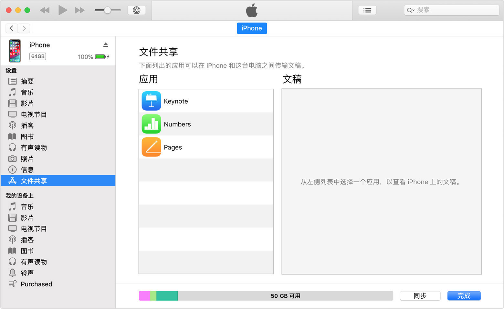
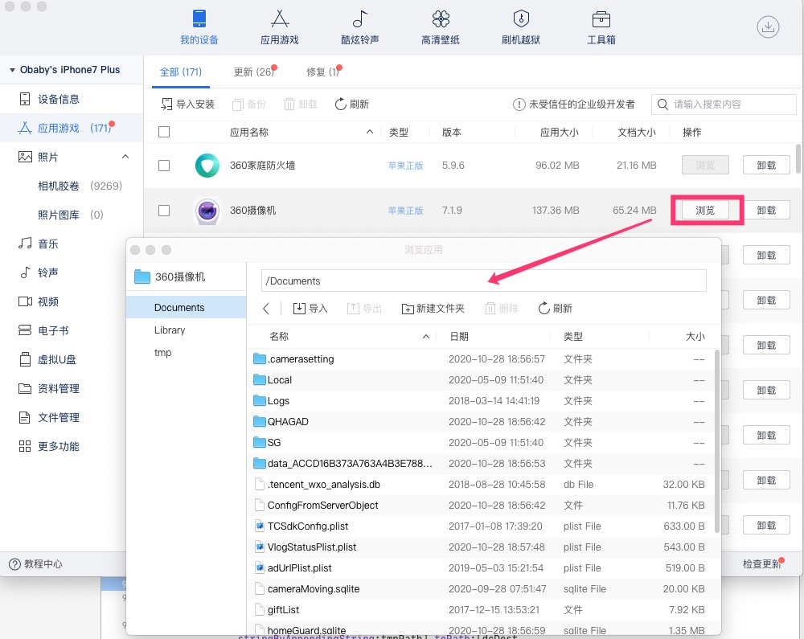
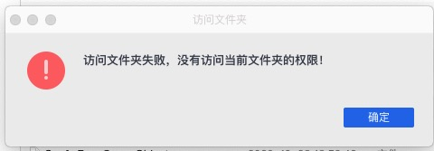

iOS无限金币安装包实现
===

在助手大行其道的的同时，另外一个比较火爆的的资源那就是带各种破解存档的游戏的需求。  
在itunes12之前的版本,如果要如果app开放了文档共享权限，那么可以通过读写共享文档的方法来恢复存档。  
  
但是该方法也仅限于旧版本的itunes，最新的itunes相关已经被彻底的停用了，可以通过爱思助手来查看共享文件。  
  
不过使用该方法只能访问Document目录，如果要访问Library目录会提示没有相关的权限。  
  
如果要开放app的文件共享权限，需要修改Info.plist将如下属性设置为yes：UIFileSharingEnabled  
不过大多数游戏的存档并不是仅仅存在于Document目录下，那么对于这类游戏如果要复制游戏存档这种方法就行不通了。  
不过要解决这个问题可以使用dylib注入的方式。简单说来只需要如下几步：
1. 将游戏的存档压缩到ipa文件中，如果要减小ipa的体积可以压缩，如果要提高效率可以直接将目录下所有的文件压缩到ipa目录下
2. 编写一个支持将存档文件恢复到游戏的Document、Library、tmp目录下的dylib，将dylib注入到指定的ipa中
3. 对ipa进行签名，签名之后的ipa安装到设备上即可，在游戏首次运行的时候会直接将所有的文件解压缩并且恢复到游戏对应的目录下。

经过如下几部之后，就可以实现游戏存档或者金币的无限制恢复了，并且如果要做的更彻底一些，可以在dylib中集成多个存档，编写ui界面选择要恢复的存档文件，如果要做的更深入可以通过oss等网络存储，直接在存储上上传存档，下载并且恢复指定的存档文件。

dylib的关键代码相对来说也比较简单：
```javascript
//  iOS 存档恢复工具
//  hzm.m
//  hzm
//  http://www.h4ck.org.cn
//  Created by obaby on 15/9/22.
//  Copyright (c) 2015年 obaby@mars. All rights reserved.
//

#import "hzm.h"
#import "ZipArchive.h"

@implementation hzm

-(id)init
{
	if ((self = [super init]))
	{
	}
    
	return self;
}
//uncompress ipa file
void UnCompressiPa (NSString * cFileName ,NSString *output);

void UnCompressiPa (NSString * cFileName ,NSString *output)
{
    ZipArchive * za = [[ZipArchive alloc]init];
    
    if ([za UnzipOpenFile:cFileName]) {
        if ([za UnzipFileTo:output overWrite:YES] != NO) {
            //std::cout << ipafileName.UTF8String <<" have been unziped success\n";
            NSLog(@"%@ have benn unzipped success !\n",cFileName);
        }
        [za UnzipCloseFile];
    }
    //[za release];
}

//检测文件目录是否存在
BOOL isFileExists(NSString * filename)
{
    NSFileManager * filemanager;
    filemanager = [[NSFileManager alloc]init];
    if (![filemanager fileExistsAtPath:filename]) {
        return NO;
    }
    return YES;
}

static void __attribute__((constructor)) initialize(void)
{
    
    NSLog(@"======================= lib注入成功 ========================");
    
    
    //无线金币
    NSString *outputdir = [NSHomeDirectory() stringByAppendingString:@"/tmp"] ;
    if (!isFileExists(outputdir)) {
        [[NSFileManager defaultManager] createDirectoryAtPath:outputdir withIntermediateDirectories:YES attributes:nil error:nil];
        NSLog(@"[*]无限金币：Output dir:%@ created!",outputdir);
    }
    
    NSString *isFirstRunSigFile =[NSHomeDirectory() stringByAppendingString:@"/Documents/isFirst"] ;
    if (isFileExists(isFirstRunSigFile)) {
        NSLog(@"[*]无限金币：not first time run nothing do!");
    }else{
        NSString *dataFile = [[NSBundle mainBundle] pathForResource:@"coin" ofType:@"zip"];
        UnCompressiPa(dataFile, outputdir);
        NSLog(@"[*]无限金币：First time run,file uncompressed and installed");
        NSString *sigeFiledata = @"NO";
        [sigeFiledata writeToFile:isFirstRunSigFile atomically:YES encoding:NSUTF8StringEncoding error:nil];
        NSLog(@"[*]无限金币：Sig file created!");
        
        NSLog(@"copy all files to documents");
        
        NSString *dcPath = [outputdir stringByAppendingString:@"/Container/Documents/"];
        
        NSString *dcDest = [NSHomeDirectory() stringByAppendingString:@"/Documents/"];
        
        
        
        NSDirectoryEnumerator *dcEnum  = [[NSFileManager defaultManager] enumeratorAtPath:dcPath];
        
        NSString *tmpPath ;
        
        sleep(2);
        
        //NSLog(@"%@",dcEnum);
        //[NSTemporaryDirectory() stringByAppendingString:tmpPath]
        NSError *err;
        
        while ((tmpPath = [dcEnum nextObject]) != nil) {
            NSLog(@"%@",[dcPath stringByAppendingString:tmpPath]);
            [[NSFileManager defaultManager] removeItemAtPath:[dcDest stringByAppendingString:tmpPath] error:nil];
            BOOL bStatus = [[NSFileManager defaultManager] copyItemAtPath:[dcPath stringByAppendingString:tmpPath] toPath:[dcDest stringByAppendingString:tmpPath]error:&err];
            if (bStatus == NO) {
                NSLog(@"%@ copy failed!",[dcDest stringByAppendingString:tmpPath]);
            }
        }
        
        
        
        NSString *lbPath = [outputdir stringByAppendingString:@"/Container/Library/"];
        NSString *lbDest = [NSHomeDirectory() stringByAppendingString:@"/Library/"];
        
        NSDirectoryEnumerator *lbEnum = [[ NSFileManager defaultManager] enumeratorAtPath:lbPath];
        
        while ((tmpPath = [lbEnum nextObject] )!= nil) {
            NSLog(@"%@",[lbPath stringByAppendingString:tmpPath]);
            [[NSFileManager defaultManager] removeItemAtPath:[lbDest stringByAppendingString:tmpPath] error:nil];
            BOOL bStatus =[[NSFileManager defaultManager] copyItemAtPath:[lbPath stringByAppendingString:tmpPath] toPath:[lbDest stringByAppendingString:tmpPath]error:&err];
            if (bStatus == NO) {
                NSLog(@"%@ copy failed!",[lbDest stringByAppendingString:tmpPath]);
            }
            
        }
        
        
        NSString *tmPath = [outputdir stringByAppendingString:@"/Container/tmp"];
        NSString *tmDest = [NSHomeDirectory() stringByAppendingString:@"/tmp"];
        NSDirectoryEnumerator *tmEnum = [[NSFileManager defaultManager] enumeratorAtPath:tmpPath];
        while ((tmpPath = [tmEnum nextObject] )!= nil) {
            NSLog(@"%@",[tmPath stringByAppendingString:tmpPath]);
            [[NSFileManager defaultManager] removeItemAtPath:[tmDest stringByAppendingString:tmpPath] error:nil];
            BOOL bStatus = [[NSFileManager defaultManager] copyItemAtPath:[tmPath stringByAppendingString:tmpPath] toPath:[tmDest stringByAppendingString:tmpPath] error:&err];
            if (bStatus == NO) {
                NSLog(@"%@ copy failed!",[tmDest stringByAppendingString:tmpPath]);
            }
        }
        
    }
    //sleep(5);
    NSLog(@"======================= All done ========================");
    
    
}


@end

```

> @author: obaby  
> @license: (C) Copyright 2013-2020, obaby@mars.  
> @contact: root@obaby.org.cn   
> @link:   <http://www.obaby.org.cn>  
> @blog:   <http://www.h4ck.org.cn>  
> @findu:  <http://www.findu.co>  


