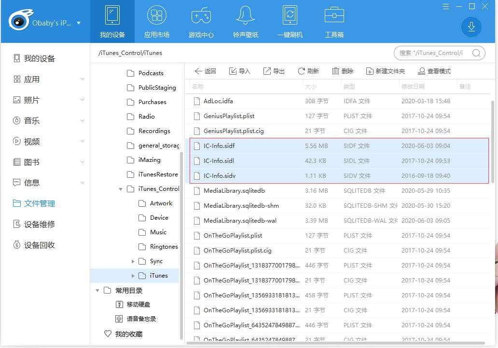
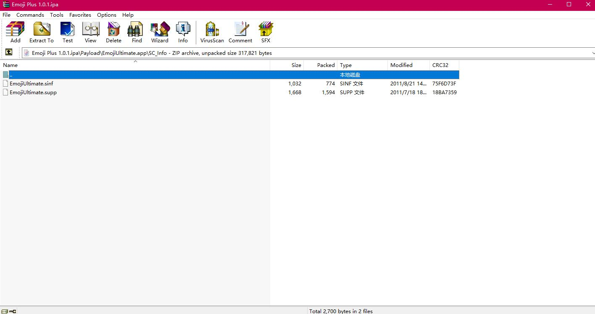
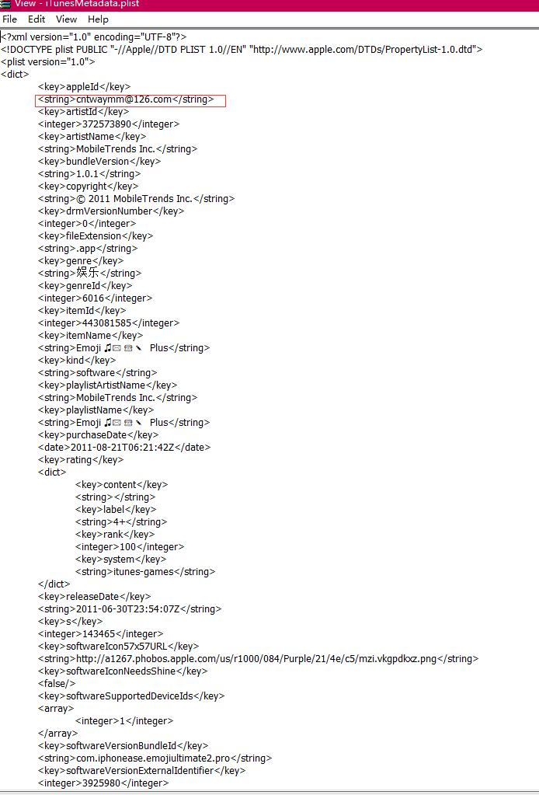
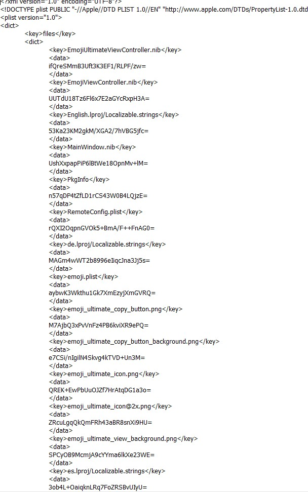
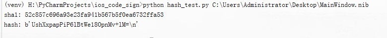

iOS 签名（一）
====

为什么要说iOS的签名呢？现在移动平台的逆向的教程和书籍已经相当多了。针对签名的文章也很多，我这里想说的一些是可能别的地方看不到的。

iOS的签名目的其实也比较纯粹，就是为了能够在不越狱的情况下安装破解版的ipa。当然，如果是各种助手的话还有另外的一个目的，那就是应用分发（更重要的是在分发之前加入自己的广告sdk）。

说到iOS的应用分发其实主要方式有如下几种：
1. 苹果的应用商店。
2. cydia应用商店。 需要越狱之后才能安装各种app和插件，并且由于现在越狱基本都是不完整越狱，重启设备之后需要重新越狱。并且越狱工具安装也异常麻烦，所以越狱的用户也少了很多
3. 第三方应用商店，国内的比较大的就那么几家。不知道的可以自己搜索一下。
第三方应用商店的app分发其实也经历了几个时期：
a. 越狱时期，最早期应用商店分发的基本都是越狱应用。这个与早期的越狱插件和完美越狱存在比较大的关系。
b. 转授权分发，这个技术最早貌似是360的快用用的这么一项技术。所谓转授权就是通过链接电脑，通过itunes的相关api调用在设备上创建IC-info文件。同样，通过苹果的应用商店下载的iap也会包含sc_info
授权信息。

通过appstore下载ipa，早期的itunes通过两步进行的。1. 下载ipa文件，此时的文件是没有任何的授权信息的，就是加密后的ipa文件。2. 通过接口创建授权文件以及相关目录SC_Info，该目录位于ipa的Payload\EmojiUltimate.app 目录下。并且同时创建iTunesMetadata.plist文件
 。该文件包含了ipa购买的apple id的相关信息。3. 将授权文件，购买信息打包到ipa内。
这个就是通过itunes最终下载到的ipa。

通过该文件可以看到，购买的appleid 为cntwaymm@126.com。各种助手也是通过该文件来判断应用的版本信息，是否是苹果的官方应用（如果要准确判断还需要依赖SC_info）。不过在安装的过程中该文件并不参与校验。即使删除该文件也可以正常安装，并且该文件不参与签名。

众所周知，苹果一向以安全著称，那么既然最后的ipa是通过拼接合成的，那么会不会在下载的过程中被篡改？或者加入一些其他的功能？其实苹果早就想到了这一点了。即使是应用商店下载的ipa也是带数字签名的。  

ipa的签名信息分为两部分：1. ipa内所有文件的签名信息 2. 可执行文件的签名信息。

ipa文件信息签名包括资源签名都位于Payload\EmojiUltimate.app\_CodeSignature 下的 CodeResources文件内：
文件部分内容：

对应文件的额哈希值为sha1 + base64， 较新的ipa同时还会有sha256 + base64的签名方式。  
计算方法： 

    with open(filepath, 'rb') as f:
        sha1obj = hashlib.sha1()
        sha1obj.update(f.read())
        hash = sha1obj.hexdigest()
        print("sha1:", hash)
        bs = base64.encodebytes(sha1obj.digest())
        print("hash:", bs)
        
通过计算可以发现，数值与plist文件中的数值是一样的：

看到这里，既然已经知道了计算方法，那么是不是可以修改文件，更新哈希值之后进行安装呢? 如果尝试以下你就会发现这条路行不通！为什么？哈希明明是对的？

那是因为虽然当前文件的哈希是对的，但是由于文件内容变化，导致整个CodeResources文件的哈希值变了。而这个文件的哈希值则是记录在可执行文件的CodeDirectory下的。

