iOS 签名杂谈（二）
====

上一篇中提到替换SC-info后的ipa依旧可以安装，至于原因其实也很简单。仔细查看CodeResources文件，就知道原因了。文件内容如下：

```xml
<?xml version="1.0" encoding="UTF-8"?>
<!DOCTYPE plist PUBLIC "-//Apple//DTD PLIST 1.0//EN" "http://www.apple.com/DTDs/PropertyList-1.0.dtd">
<plist version="1.0">
<dict>
	<key>files</key>
	<dict>
		<key>EmojiUltimateViewController.nib</key>
		<data>
		ifQreSMmB3Uft3K3EF1/RLPF/zw=
		</data>
		<key>EmojiViewController.nib</key>
		<data>
		UUTdU18Tz6Fl6x7E2aGYcRxpH3A=
		</data>
		<key>English.lproj/Localizable.strings</key>
		<data>
		53Ka23KM2gkM/XGA2/7hVBG5jfc=
		</data>
		<key>MainWindow.nib</key>
		<data>
		UshXxpapPiP6lBtWe18OpnMv+lM=
		</data>
		<key>PkgInfo</key>
		<data>
		n57qDP4tZfLD1rCS43W0B4LQjzE=
		</data>
		<key>RemoteConfig.plist</key>
		<data>
		rQXI2OqpnGVOk5+BmA/F++FnAG0=
		</data>
		<key>de.lproj/Localizable.strings</key>
		<data>
		MAGm4wWT2b8996eIiqcJna3Jj5s=
		</data>
		<key>emoji.plist</key>
		<data>
		aybwK3Wkthu1Gk7XmEzyjXmGVRQ=
		</data>
		<key>emoji_ultimate_copy_button.png</key>
		<data>
		M7AjbQ3xPvVnFz4PB6kviXR9ePQ=
		</data>
		<key>emoji_ultimate_copy_button_background.png</key>
		<data>
		e7CSi/nIgilN4Skvg4kTVD+Un3M=
		</data>
		<key>emoji_ultimate_icon.png</key>
		<data>
		QREK+EwPbUuOJZf7HrAtqDG1a3o=
		</data>
		<key>emoji_ultimate_icon@2x.png</key>
		<data>
		ZRcuLgqQkQmFRh43aBR8snXi9HU=
		</data>
		<key>emoji_ultimate_view_background.png</key>
		<data>
		SPCyOB9McmjA9cYYma6lkXe23WE=
		</data>
		<key>es.lproj/Localizable.strings</key>
		<data>
		3ob4L+OaiqknLRq7FoZRSBvUIyU=
		</data>
		<key>fr.lproj/Localizable.strings</key>
		<data>
		t0XzVIa6xqvmp5KagcjmB3xR7pg=
		</data>
		<key>it.lproj/Localizable.strings</key>
		<data>
		anq4JMyR1PBXVZf50ZSs1DZo/Yg=
		</data>
		<key>nl.lproj/Localizable.strings</key>
		<data>
		c8FRK0aJIXOqcXMwQnmDmw3fWBQ=
		</data>
		<key>pt.lproj/Localizable.strings</key>
		<data>
		p2Bu2xab7q2mOKGkS3ilMjlbkg4=
		</data>
		<key>zh-hans.lproj/Localizable.strings</key>
		<data>
		GDxwv2JLXA1oNSOphz4DndPk5LM=
		</data>
		<key>zh-hant.lproj/Localizable.strings</key>
		<data>
		c3wmlLx60JrmuFeU/hOcLdepdAM=
		</data>
	</dict>
	<key>rules</key>
	<dict>
		<key>.*</key>
		<true/>
		<key>Info.plist</key>
		<dict>
			<key>omit</key>
			<true/>
			<key>weight</key>
			<real>10</real>
		</dict>
		<key>ResourceRules.plist</key>
		<dict>
			<key>omit</key>
			<true/>
			<key>weight</key>
			<real>100</real>
		</dict>
		<key>^SC_Info/.*\.sinf$</key>
		<dict>
			<key>omit</key>
			<true/>
			<key>weight</key>
			<integer>10000</integer>
		</dict>
		<key>^SC_Info/.*\.supp$</key>
		<dict>
			<key>omit</key>
			<true/>
			<key>weight</key>
			<integer>10000</integer>
		</dict>
	</dict>
</dict>
</plist>
```
该文件中除了定义的参与哈希运算的文件，同时还排除了一部分文件， 排除的文件列表就是对应的rules下的内容：
```xml
<key>rules</key>
	<dict>
		<key>.*</key>
		<true/>
		<key>Info.plist</key>
		<dict>
			<key>omit</key>
			<true/>
			<key>weight</key>
			<real>10</real>
		</dict>
		<key>ResourceRules.plist</key>
		<dict>
			<key>omit</key>
			<true/>
			<key>weight</key>
			<real>100</real>
		</dict>
		<key>^SC_Info/.*\.sinf$</key>
		<dict>
			<key>omit</key>
			<true/>
			<key>weight</key>
			<integer>10000</integer>
		</dict>
		<key>^SC_Info/.*\.supp$</key>
		<dict>
			<key>omit</key>
			<true/>
			<key>weight</key>
			<integer>10000</integer>
		</dict>
	</dict>
```
网上关于resource rules具体介绍的内容比较少，但是通过签名的表现以及下载行为可以知道，这个key定义下的所有文件都没有参与签名校验。对于新版的ipa内容会更复杂一下
```xml
		<key>PlugIns/PushService.appex/SC_Info/PushService.(sinf|supp|supf|supx)$</key>
		<dict>
			<key>omit</key>
			<true/>
			<key>weight</key>
			<integer>10000</integer>
		</dict>
		<key>SC_Info/Edu901iPhone.(sinf|supp|supf|supx)$</key>
		<dict>
			<key>omit</key>
			<true/>
			<key>weight</key>
			<integer>10000</integer>
		</dict>
		<key>^(.*/)?\.DS_Store$</key>
		<dict>
			<key>omit</key>
			<true/>
			<key>weight</key>
			<real>2000</real>
		</dict>
		<key>^.*</key>
		<true/>
		<key>^.*\.lproj/</key>
		<dict>
			<key>optional</key>
			<true/>
			<key>weight</key>
			<real>1000</real>
		</dict>
		<key>^.*\.lproj/locversion.plist$</key>
		<dict>
			<key>omit</key>
			<true/>
			<key>weight</key>
			<real>1100</real>
		</dict>
		<key>^Base\.lproj/</key>
		<dict>
			<key>weight</key>
			<real>1010</real>
		</dict>
		<key>^Info\.plist$</key>
		<dict>
			<key>omit</key>
			<true/>
			<key>weight</key>
			<real>20</real>
		</dict>
		<key>^PkgInfo$</key>
		<dict>
			<key>omit</key>
			<true/>
			<key>weight</key>
			<real>20</real>
		</dict>
		<key>^embedded\.provisionprofile$</key>
		<dict>
			<key>weight</key>
			<real>20</real>
		</dict>
		<key>^version\.plist$</key>
		<dict>
			<key>weight</key>
			<real>20</real>
		</dict>
	</dict>
```
一个完整的resourcerules样例：https://support.apple.com/library/APPLE/APPLECARE_ALLGEOS/HT5914/ResourceRules-ignoring-Scripts.plist  

除了早期版本的额sc-info目录，新的ipa同时兼容了不同的Framework下的sc-info目录，并且多了个字段：^embedded\.provisionprofile$。 这个其实对应的是企业签名的mobile provison文件。  
通过这个plist其实就知道那些文件是omit（忽略）的文件了。虽然对于appstore 下载的ipa文件来说这个字段对于我们没有什么用处。但是企业签名和个人签名这个文件的意义就凸显出来了。  
控制了resourcerules也就意味着即使ipa已经签名过了，依旧可以修改里面的内容。  
不过需要注意的是，苹果在最新的osx系统上已经不支持自定义resourcerules签名了。
> Systems before OS X Mavericks 10.9 documented a signing feature (--resource-rules) to control which files in a bundle should be sealed by a code signature. This feature has been obsoleted for Mavericks. Code signatures made in Mavericks and later always seal all files in a bundle; there is no need to specify this explicitly any more. This also means that the Code Signing Resource Rules Path build setting in Xcode should no longer be used and should be left blank.

> It is thus no longer possible to exclude parts of a bundle from the signature. Bundles should be treated as read-only once they have been signed.

文章链接：https://developer.apple.com/library/archive/technotes/tn2206/_index.html#//apple_ref/doc/uid/DTS40007919-CH1-TNTAG401

尽管最新的osx已经不支持该参数，但是其实上旧版本的codesign 工具可以继续使用，并且使用该参数签名的ipa也可以正常安装。

让所有的资源文件不参与签名，可以通过下面的resource rules配置文件：
```xml
<?xml version="1.0" encoding="UTF-8"?>
<!DOCTYPE plist PUBLIC "-//Apple//DTD PLIST 1.0//EN" "http://www.apple.com/DTDs/PropertyList-1.0.dtd">
<plist version="1.0">
<dict>
	<key>rules</key>
	<dict>
		<key>.*</key>
		<false/>
	</dict>
</dict>
</plist>
```
旧版本的codesign可以通过--resource-rules=参数来指定resourcerules文件进行签名。通过该参数签名的ipa最终的签名后的ipa目录下的CodeResources文件的内容如下：   
```xml
<?xml version="1.0" encoding="UTF-8"?>
<!DOCTYPE plist PUBLIC "-//Apple//DTD PLIST 1.0//EN" "http://www.apple.com/DTDs/PropertyList-1.0.dtd">
<plist version="1.0">
<dict>
	<key>files</key>
	<dict/>
	<key>files2</key>
	<dict/>
	<key>rules</key>
	<dict>
		<key>.*</key>
		<false/>
	</dict>
	<key>rules2</key>
	<dict>
		<key>.*</key>
		<false/>
		<key>^(Frameworks|SharedFrameworks|PlugIns|Plug-ins|XPCServices|Helpers|MacOS|Library/(Automator|Spotlight|LoginItems))/</key>
		<dict>
			<key>nested</key>
			<true/>
			<key>weight</key>
			<real>0.0</real>
		</dict>
	</dict>
</dict>
</plist>
```
与第一篇文章中的文件对比就可以看出区别来了，新的签名文件中所有的原来的base64 加密后的sha1 以及sha256的哈希都已经不存在了。那么此时也就意味着，文件中所有的资源都是可以进行二次修改的，而此时的修改并不需要进行二次签名。修外完成之后重新压缩就可以直接往设备上安装了。  

另外签名之后的ipa 文件内会多一个embedded.mobileprovision（下文有时会简写为mp）文件，这个文件是在签名的过程中添加到ipa的payload目录下的。对于重新签名的ipa，这个文件其实起到了和appstore的下载的ipa文件中的sc-info文件同样的作用，定义了ipa的授权信息。  

在理解这个授权机制之前可以先大概了解下mobileprovision文件的来源，通常该文件在使用开发者证书进行开发或者分发的时候由xcode 自动管理，并不需要开发者关心如何的生成。每当添加一个新的设备进行调试的时候xcode会自动注册新设备到指定的bundleid对应的mp文件中。
对应的xcode中的配置为 Automatically manage sigining:
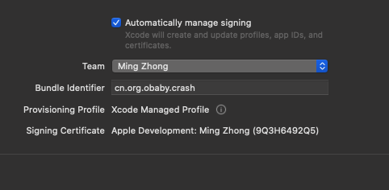  
对于正常开发这个还是比较有用的，但是对于非正常的开发就比较蛋疼，因为你没有办法使用一个已经存在的bundleid来创建项目，例如com.tencent.qq之类的bundleid是不能创建的。
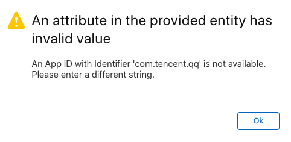  
虽然不能创建这个bundleid，但是并不是意味着签名之后的qq也不能使用原来的bundleid。创建的mobileprovision文件的bundleid和ipa的原始的bundleid并不是要求必须一致的。
另外，虽然苹果的后台可以创建wild的bundleid，但是这种类型的bundleid也有诸多限制。例如推送之类的是没有办法正常使用的。  
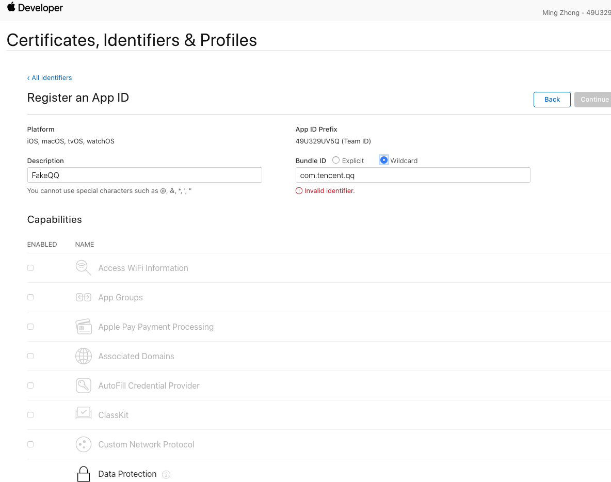
具体有开发者账号的可以自己登陆苹果开发者后台查看对应的区别。另外如果没有开发者账号，对于普通的appleid试用开发者功能的mobileprovision文件创建不在本文的讨论范围内。文件创建流程可以自己跟踪xcode进行观察。  
另外对于实际的签名过程至于是开发的mp文件还是分发的mp文件，在实际的使用效果中区别比较大的是推送模块。如果重新签名之后的文件需要使用推送功能，那么建议使用分发模式的mp文件， 并且在bundleid中配饰push功能并增加对应的push证书。  
mp文件的主要作用有三个：
- 定义了ipa的entitlement权限信息
- 定义了授权设备列表。
- 授权文件自身的一些关键信息：有效期，开发者信息，bundleid信息，uuid信息， 授权证书信息。 
mp文件本身是一个二进制文件，如下所示：
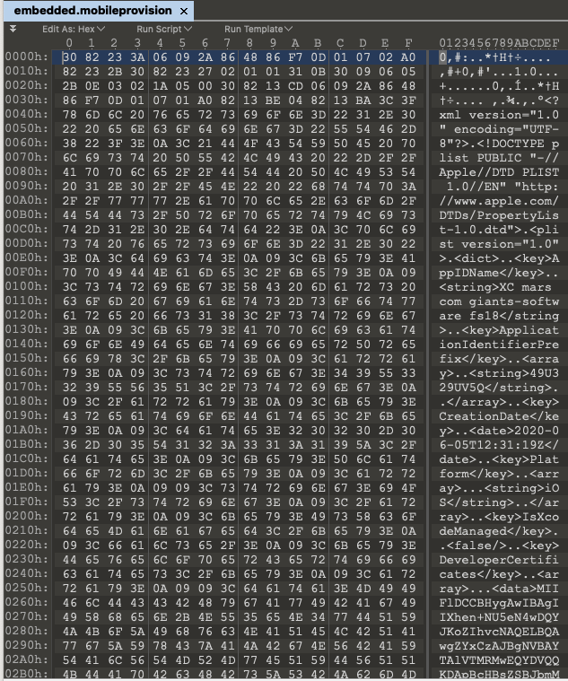  
下面分别来说明这些信息：  

----
###entitlement权限信息
该信息主要是定义了ipa的权限信息，并且在签名的过程中该权限信息虽然不要求与ipa二进制文件的权限信息完全一致，但是如果完全不一致可能会导致安装失败，闪退等问题。
osx的mp文件预览可以直接查看权限信息。
  
另外通过security 命令可以查看mp中的文本信息：  
```bash
cms -D -i /Volumes/DATA/python_projects/ios_code_sign/飞机流量查询\ FlightRadar24\ Pro-6.7.0\(越狱应用\)_RESIGNED/Payload/Flightradar24.app/embedded.mobileprovision
```
可以看到展示的信息和预览是一致的：
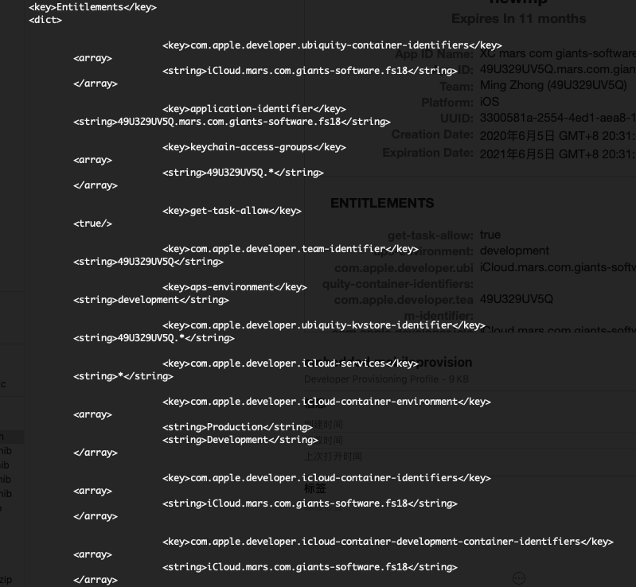  
对于签名后的ipa可以通过ldid的命令查看签名后的entitlement信息：  
```bash
ldid -e /Volumes/DATA/python_projects/ios_code_sign/飞机流量查询\ FlightRadar24\ Pro-6.7.0\(越狱应用\)_RESIGNED/Payload/Flightradar24.app/Flightradar24 
```
内容如下：  
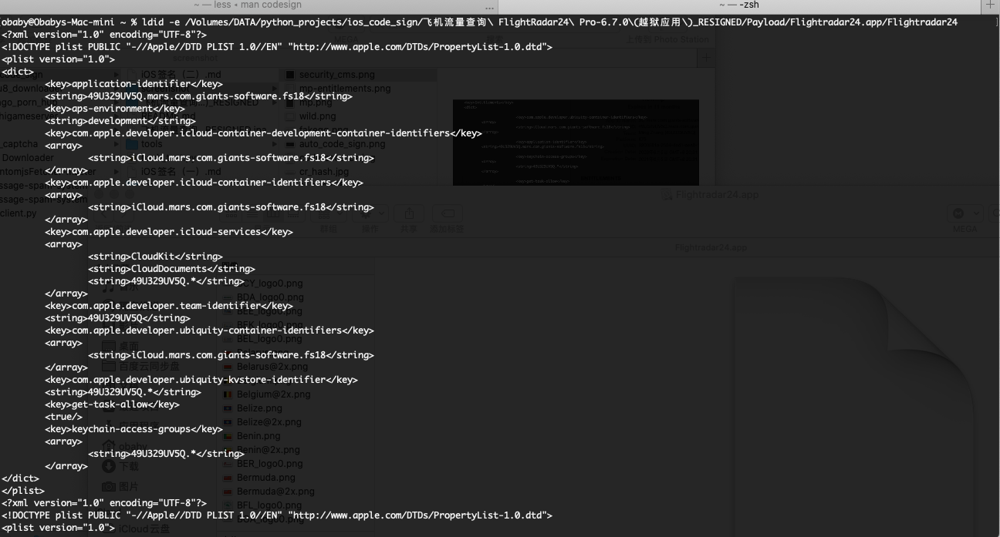  

通过对比可以发现签名后的二进制文件的entitlement和mp中的entitlement文件内容大部分还是一致的。区别是并没有存储在一个单独的<key>Entitlements</key>目录下。  
前面曾经提过并不要求bundleid完全一致，我这里的bundleid是 49U329UV5Q.mars.com.giants-software.fs18，在苹果开发者后台创建的bundleid为mars.com.giants-software.fs18，但是在创建mp文件的时候系统会自动将开发者的id添加到bundleid前面。  
而重签名的应用的bundleid是se.resenatverket.FlightRadar24，如下：  
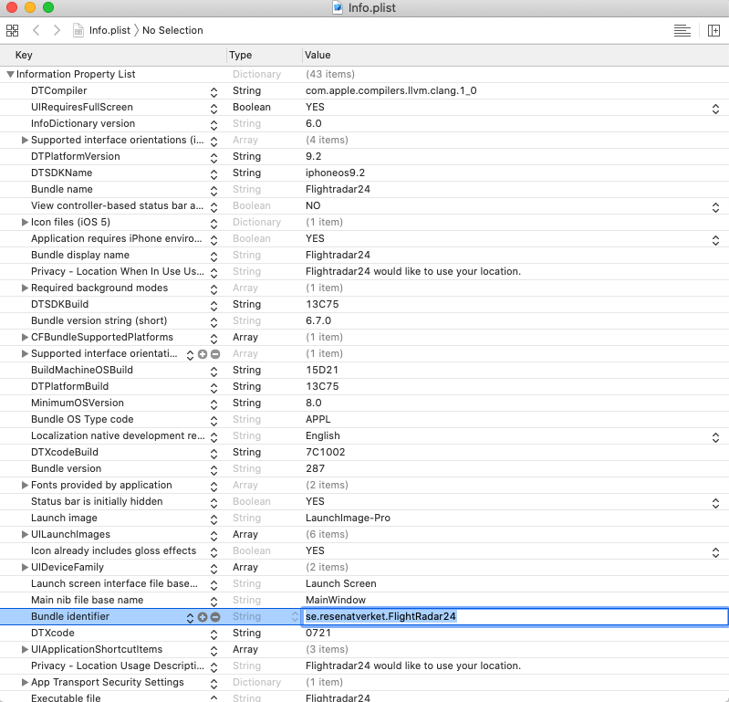  
虽然两者不一样，但是不会影响正常的安装。并且对于使用自定义resourcerules签名的ipa通过codesign进行校验的时候会展示如下信息：
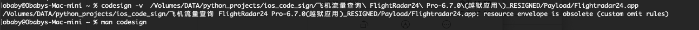  
签名结果显示使用了自定义的忽略规则，通过这个命令也可以知道ipa是否使用了自定义的resourcerules。
所以签名之后如果不能安装并不是bundleid的问题，可以从其它方面找一下原因。
另外提一下，虽然ldid有个 -s参数可以给二进制写入entitlement信息，但是不建议通过该命令给ipa签名。如果是越狱系统不想使用codesign可以使用ldid给二进制文件写入权限，例如给debug-server写入权限。
如果是ipa签名可以通过codesign的--entitlements path 参数写入entitlement信息：
> --entitlements path
             When signing, take the file at the given path and embed its contents in the signature as entitlement data. If the data at path does not already begin
             with a suitable binary ("blob") header, one is attached automatically.
             When displaying a signature, extract any entitlement data from the signature and write it to the path given. Use "-" to write to standard output.  By
             default, the binary "blob" header is returned intact; prefix the path with a colon ":" to automatically strip it off.  If the signature has no entitle-
             ment data, nothing is written (this is not an error).

更多关于codesign的参数可以通过命令 man codesign查看详细说明，如果感觉不够详细可以查看苹果的官方文档。  

----
###授权设备列表
该信息存在于mp文件中的ProvisionedDevices字段下。对于授权设备列表有两种类型，这两种类型其实最根本的区别在于企业开发者和个人开发者的区别。
对于个人开发者只有一种形式，那么就是设备列表的形式，格式如下：  
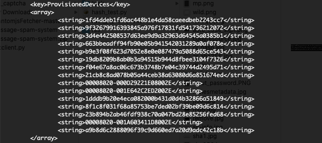  
该列表定义了那些设备可以安装签名后的ipa文件，对应的数据内容为设备的uuid，获取uuid主要有两种方法，1：使用各种助手，2：通过安装设备描述文件。具体的实现方法感兴趣可以自己搜索。
如果不在该列表内，那么签名后的ipa是无法安装的。  
上面提到的是个人开发者，那么企业开发者还有另外一种形式，如下所示：  
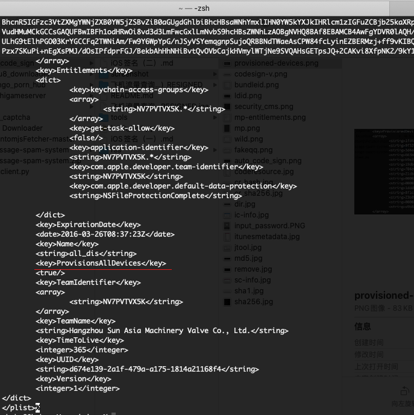  
对比就可以发现两者的区别，企业的mp文件多了一个ProvisionsAllDevices字段，去掉了ProvisionedDevices字段。新加的字段意味着，只要签名合法，那么所有的设备都可以安装签名后的ipa文件。这也是为什么企业开发者签名成了个大助手应用分发的主要方式。  

---
###授权文件自身的一些关键信息
其实该字段主要的信息是mp文件自身的有效期，该信息通过两部分实现，一个是创建日期，另外一个是ttl。展示为如下的两部分：  
CreationDate：  
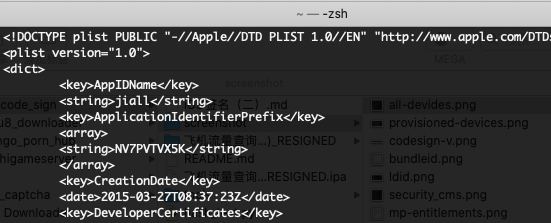  
TTL:  
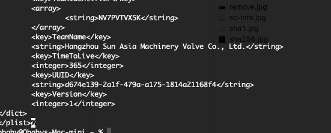  
通过上面两部分就可以计算出mp文件的过期时间了。如果mp文件过期以后，签名的ipa就无法正常安装了。然而，mp过期并不需要重新签名，如果使用前面的自定义签名规则文件签名，只需要重新创建一个同样的mp文件压缩到ipa内替换即可继续安装了。  
这里说的一样，意思是：
- 使用的同样的开发者账号，同样的bundleid创建的mp文件
- 开发者后台bundleid下的权限尽量不要修改，保持与过期之前一致。
- 开发者证书没有过期，并且开发者账号没有被封。

贴一下项目地址：
<https://github.com/obaby/ios_code_sign>

一二中用到的工具和样本已经在项目中包含，有需要的可以自行下载。
第三篇的时候会简单的写一下，osx上的签名技巧。  